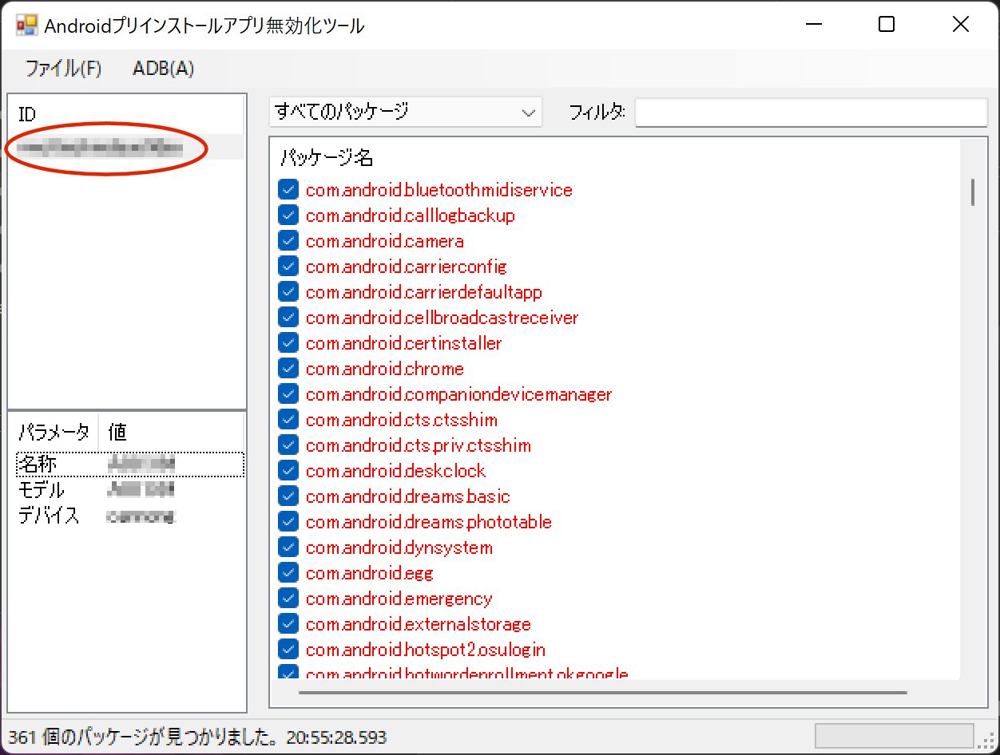
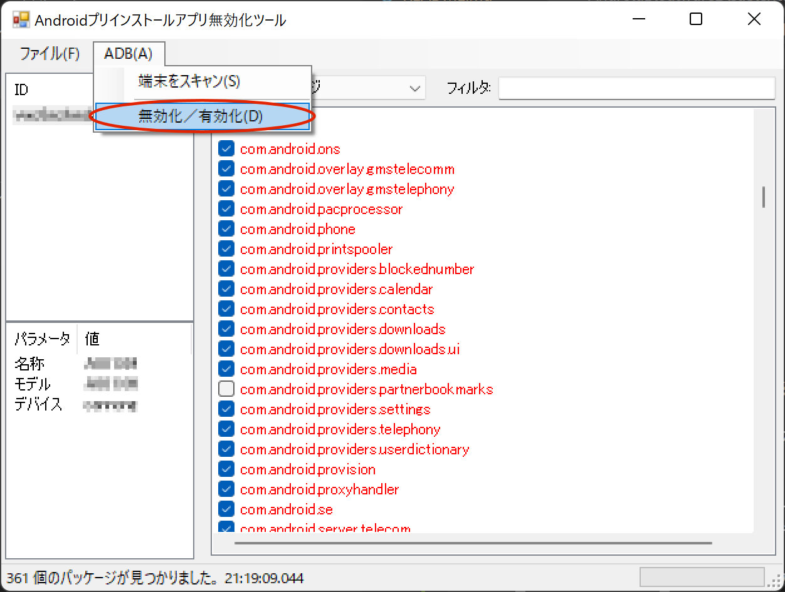
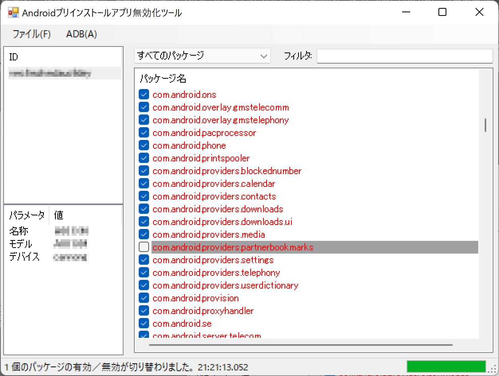

# AndroidBloatwareDisabler

## 何これ？
- Android端末のアプリ無効化を支援するWindowsアプリケーションです。
- キャリアスマホにありがちな無効化できないプリインストールアプリ（Bloatware）をPC経由で無効化します。
- adbコマンドをいちいち打つのが面倒な方向けのツールです。

## 注意事項

プリインストールアプリを無効化すると端末が正常に動作しなくなる場合があります。
本ツールは自己責任の範囲において使用してください。

ツールの使用によって発生した一切の損害に対して作者は責任を負いません。

## 必要なもの

- WindowsPC
  - .NET Framework 4.7.2が動作すること。
  - ADBドライバがインストールされていること。
- 対象のAndroid端末（スマートフォン、タブレット）
  - USBデバッグが有効になっていること。
- PCとAndroid端末を接続するUSBケーブル
  
## インストール手順

1. ツールのzipファイルをダウンロードする。
2. ダウンロードしたzipファイルを展開する。
3. [Platform-Tools for Windows](https://developer.android.com/studio/releases/platform-tools)をダウンロードする。
4. ダウンロードしたzipファイルを'platform-tools' フォルダに展開する。

ファイル構成が下図のようになったらOKです。

```
AndroidBloatwareDisabler/
│  ABD.exe
│  
├─ja/
│      ABD.resources.dll
│      
└─platform-tools/
    │  adb.exe
    │  AdbWinApi.dll
    │  AdbWinUsbApi.dll
    ：
```

## 使い方

1. PCとAndroid端末をUSBケーブルで接続する。
2. 'ADB.exe'を起動する。
3. 対象のAndroid端末をメインウィンドウ左上のID欄から選択する。

4. メインウィンドウ右側のパッケージ名一覧から無効にしたいパッケージのチェックボックスを非チェック状態にする。
（システムアプリは赤文字、サードパーティアプリは黒文字で表示。また、無効化されているパッケージは背景がグレー）
5. [ADB]メニューの[無効化／有効化]をクリックする。

6. メインウィンドウ下部のプログレスバーが100%になったら完了。

