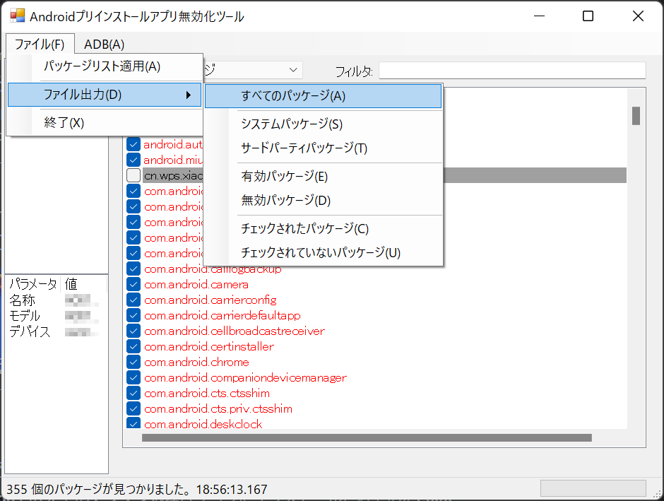
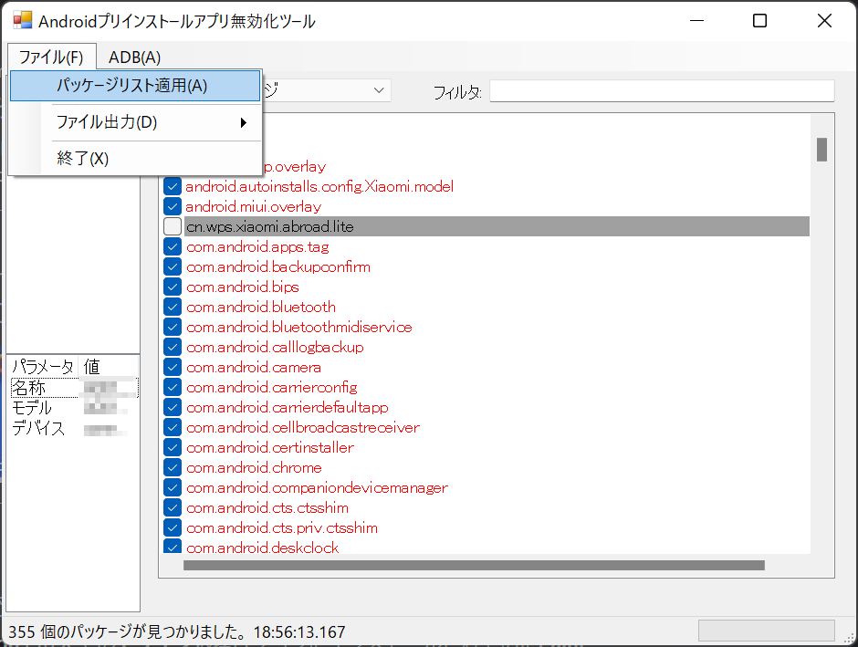
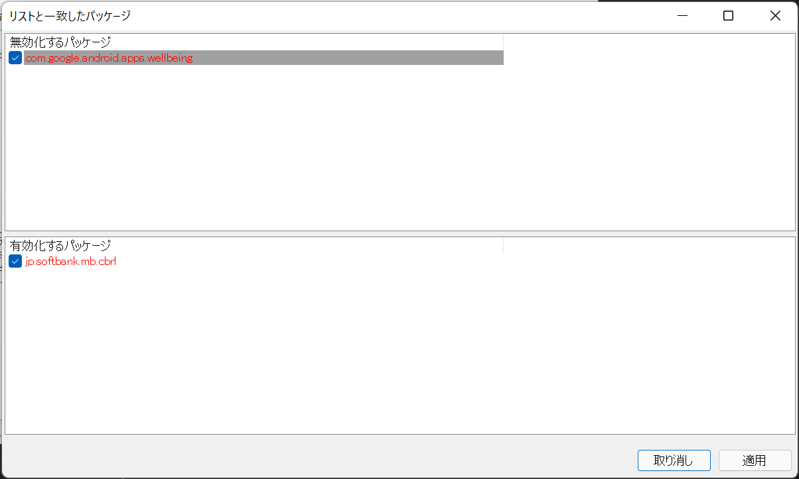

# AndroidBloatwareDisabler

## 何これ？
- Android端末のアプリ無効化を支援するWindowsアプリケーションです。
- キャリアスマホにありがちな無効化できないプリインストールアプリ（Bloatware）をPC経由で無効化します。
- adbコマンドをいちいち打つのが面倒な方向けのツールです。

## 注意事項

プリインストールアプリを無効化すると端末が正常に動作しなくなる場合があります。
本ツールは自己責任の範囲において使用してください。

ツールの使用によって発生した一切の損害に対して作者は責任を負いません。

## 更新履歴

- Ver.0.2.0
  - [パッケージリスト](#パッケージリストの使い方)の入出力に対応。


## 必要なもの

- WindowsPC
  - .NET Framework 4.7.2が動作すること。
  - ADBドライバがインストールされていること。
- 対象のAndroid端末（スマートフォン、タブレット）
  - USBデバッグが有効になっていること。
- PCとAndroid端末を接続するUSBケーブル
  
## インストール手順

1. ツールのzipファイルをダウンロードする。
2. ダウンロードしたzipファイルを展開する。
3. [Platform-Tools for Windows](https://developer.android.com/studio/releases/platform-tools)をダウンロードする。
4. ダウンロードしたzipファイルを'platform-tools' フォルダに展開する。

ファイル構成が下図のようになったらOKです。

```
AndroidBloatwareDisabler/
│  ABD.exe
│  
├─ja/
│      ABD.resources.dll
│      
└─platform-tools/
    │  adb.exe
    │  AdbWinApi.dll
    │  AdbWinUsbApi.dll
    ：
```

## 使い方
### 基本編
1. PCとAndroid端末をUSBケーブルで接続する。
2. 'ADB.exe'を起動する。
3. 対象のAndroid端末をメインウィンドウ左上のID欄から選択する。
  
4. メインウィンドウ右側のパッケージ名一覧から無効にしたいパッケージのチェックボックスを非チェック状態にする。
（システムアプリは赤文字、サードパーティアプリは黒文字で表示。また、無効化されているパッケージは背景がグレー）
5. [ADB]メニューの[無効化／有効化]をクリックする。
  
6. メインウィンドウ下部のプログレスバーが100%になったら完了。
  

### パッケージリストの使い方
#### 接続しているデバイスのパッケージリストを保存する
1. [ファイル]-[ファイル出力]メニューの項目から出力したいパッケージリストの項目をクリックする。
  
2. 画面に従ってパッケージリストのファイルを保存する。
#### パッケージリストを適用する
1. [ファイル]-[パッケージリスト適用]をクリックするか、パッケージリストファイルをメインウィンドウにドラッグアンドドロップする。
   
2. 無効化設定のパッケージ名がメイン画面でチェック状態の場合、無効化するパッケージの一覧に表示されます。有効化設定のパッケージ名がメイン画面でチェックされていない状態の場合、有効化するパッケージの一覧に表示されます。
   
3. 設定を適用するパッケージ名をチェック状態にし、[適用]をクリックするとメイン画面のパッケージ名一覧に反映されます。

#### パッケージリストの記法
パッケージリストファイルには無効化または有効化を指示するコマンド（指定された文字列のみの行）とパッケージ名が記載されています。
ファイル中に以下のコマンドを検出すると後続のパッケージ名の無効化対象とします。
```
@disabled
```
後続のパッケージ名の有効化する場合は以下のコマンドを記述します。
```
@enabled
```
2つのコマンドはそれぞれエイリアスがあります。
```
@unchecked    # <- @disabledのエイリアス
@checked      # <- @enabledのエイリアス
```
パッケージ名は行頭に空白を入れたりせず一行ずつ記載してください。
```
@disabled
com.bloatware.www
com.unneccessaryapp.xxx

@enabled
com.donotdisable.yyy
com.neccessaryapp.zzz
```
行頭が `#` で始まる場合、その行はコメントとして扱われます。

```
# This app should be disabled.
com.spyware.xxx
```